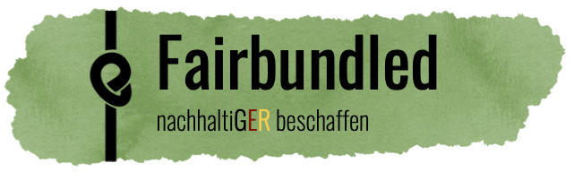

<!-- PROJECT LOGO -->
<br />

<p align="center">
  <a href="https://github.com/lschlesinger/fairbundled">
    
  </a>

  <p align="center">
    This is a Web Application Engineering Project at TUM University, Munich
    <br />
  </p>
</p>

[](https://fairbundled.herokuapp.com/)


<!-- TABLE OF CONTENTS -->

## Table of Contents

* [About the Project](#about-the-project)
  * [Description](#description)
  * [Built With](#built-with)
* [Project Status](#project-status)
* [Technical Documentation](#technical-documentation)
* [Getting Started](#getting-started)
* [License](#license)

<!-- ABOUT THE PROJECT -->

## About the Project

### Description

**Fairbundled** is an online marketplace to enable municipalities to acquire sustainable and certified supplies by gathering offered sustainable products and bundling the demands of multiple buyers to achieve more affordable prices.

We are motivated to promote *sustainable* procurement in German municipalities!

Reported pains occurring during procurement processes in city administration are (i) high costs for sustainable products that do not match the budget and/or are difficult to justify, (ii) analogue, decentralized and bureaucratic overhead of product comparison, selection and ordering, and (iii) ambiguity with respect to certification integrity and relevance.

These are addressed by the following main features of **Fairbundled**:

- **Order Bundling**: Enabling customers to collectively submit an order, leads to larger order volumes which provide plannability and scaling effect on the supplier side, resulting in lower product prices.
- **Online Marketplace**: Fairbundled serves the one shop stop for online sustainable procurement irrespective of certain supplier products brands or product groups. Products are filterable and can be compared in a convenient, easy-to-access user interface.
- **Certification Transparency**: Fairbundled verifies integrity of relevant certifications with respect to sustainability aspects and displays is transparently in the user interface.

So don't hesitate:

Check out the [Fairbundled](https://fairbundled.herokuapp.com/)


### Built With

* [NodeJs](https://nodejs.org/en/) (≥10)
* [Express](https://expressjs.com/)
* [React](https://reactjs.org/)
* [Ant Design](https://ant.design/docs/react/introduce)
* [MongoDB](https://www.mongodb.com/de)
* [Heroku](https://www.heroku.com/)
* [Docker](https://www.docker.com/)


<!-- PROJECT STATUS -->

## Project Status

### Specific implementation tasks

The following table summarizes the status of specific implementation tasks structured by the app's URL's, associated Use Cases (see below) and Views.

Frontend implementation covers a well designed and functioning frontend interaction of a user whereas backend implementation covers the existence of respective endpoints, triggering the retrieval of well defined data from the database.

**UC_I**: Offer a product as supplier

**UC_II**: Search a product

**UC_III**: Create Fairbundle for specific product as municipality

**UC_IV**: Join existing Fairbundle for a specific product as municipality

**UC_GENERAL**: general functionality, required for prototype

| FrontendURL       | UC           | Associated View incl. Modal                                  | Frontend Implementation | Backend Implementation |
| ----------------- | ------------ | ------------------------------------------------------------ | ----------------------- | -------------------- |
| `/`               | UC_II        | `LandingView`                                                | In Progress             | In Progress          |
| `/register`       | UC_GENERAL   | `RegisterView`                                               | Done                    | Done                 |
| `/login`          | UC_GENERAL   | `LoginView`                                                  | Done                    | Done                 |
| `/product`        | UC_II, UC_IV | `ProductListView`                                            | Done                    | Done                 |
| `/product/:id`     | UC_III       | `ProductDetailView`  `CreateFairbundleModalView` ` FairbundleCreatedModalView` | In Progress       | Done                 |
|                   | UC_IV        | `ProductDetailView`  `JoinFairbundleModalView`  `FairbundleJoinedModalView` | In Progress       | Done                 |
| `/product/create` | UC_I         | `ProductCreateView`  `ProductPreviewModalView`                | Done              | Done                 |
| `/account`        | UC_I         | `AccountView` for supplier                                   | In Progress             | In Progress          |
|                   | UC_GENERAL   | `AccountView` for municipality                               | Planned                 | Planned              |


### General implementation tasks

- Header / Footer Design (done)
- Authorization (done)
- Data validation (done for product creation)
- Database setup (done)
- Database enrichment with mock data (done to a very limited degree)

### Organizational tasks

- Project structure / repo organization (done)
- Task and issue management (done)
- Documentation (ongoing)


<!-- TECHNICAL DOCUMENTATION -->

## Technical Documentation

Additional material documenting technical decisions, such as the UML Class Diagram, are collected in the [`docs`](./docs) folder on the project's top level and explained in the respective [`README.md`](./docs/README.md) file.

<!-- GETTING STARTED -->

## Getting Started

To get a local copy up and running follow these simple steps.

1. Clone the repo

```sh
git clone git@github.com:lschlesinger/fairbundled.git
```

2. Navigate into subfolders to find out about requirements and further installation steps

<!-- LICENSE -->

## License

Distributed under the MIT License. See `LICENSE` for more information.
