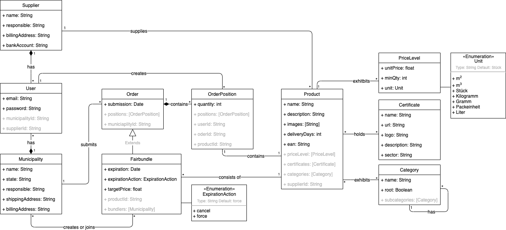

# Table of Contents

* [Data Model](#data-model)
  * [UML Class Diagram](#uml-class-diagram)
  * [Entities](#entities)
* [Project Folder Structure](#project-folder-structure)
  * [Backend](#backend)
  * [Frontend](#frontend)
* [Routes](#routes)
  * [Backend](#backend-endpoints)
  * [Frontend](#frontend-urls)
* [Authorization](#authorization)
  * [Token](#token)
  * [Middleware](#middleware)

  

<!-- DATA MODEL -->

# Data Model

<!-- UML -->

## UML Class Diagram





### Explanation:

The UML Class Diagram displays a data model implemented with a NoSQL MongoDB.

The field `id` is automatically created (as `_id` field), when respective entity is modeled as database collection. This is the case for all entities except for `PriceLevel`  (defined inline in `Product` model's field).

The grayish displayed id-fields represent a foreign key, i.e. a reference to a certain entity.


<!-- ENTITIES -->

## Entities

Introduced by logical units

### User / Supplier / Municipality

A `User` is either registered as member of a `Municipality` and therefore has a `municipalityId` or as member of a `Supplier` with a `supplierId` respectively. 

 `email` and `password` (used for login) are the only obligatory `User` information.

Further information (such as `billingAddress` or `responsible`) are associated to user's municipality or supplier.

Further information such as addresses, e.g. `billingAddress`, `shippingAddress`, `deliveryAddress`are collected where necessary. In any case, since a registered `User` acts only as representative, a (legal) `responsible` for the associated entity is required.


### Product / PriceLevel / Certificate / Category

A `User` who is associated with a supplier (having `supplierId`) can create a `Product`, thus expanding the product range on the platform. The attributes name, `description`, number of `deliveryDays`, `ean` code to match the product with a common standard identifier, uploaded `image`(s) characterize the offered product. Images are for simplicity stored in a base64-encoded string. Furthermore, arbitrary `PriceLevel`, consisting of a `unitPrice` and `minQuantity` fixed in pairs need to be specified during the process of product creation. These in turn serve as possible bundling options. Additionally, a product holds diverse `Certificates`, which are represented by `name`, a brand `logo`, a `description` and a `sector`. The `sector` will be mapped to a `Category`. Categories can be nested and thus follow a composite pattern. The ones that are considered as `root` Categories will be flagged.


### Order / BundleOrder / OrderPosition

A `User` who is associated with a municipality having (`municipalityId`) can add single `OrderPositions` of a certain `Product` of arbitrary quantity (`qty`). One or multiple of these positions compose an `Order`, whose `submission`date is recorded.

As the main feature of the online platform for sustainable procurement, municipalities are enabled to bundle the demand for **one** `Product`. This behaviour is mapped by the entity `Fairbundle`. It extends a regular `Order` and allows other municipalities to join the bundled order until a certain `expirationDate` and under the predefined conditions. These are set by the `Municipality` creating the `Fairbundle` and include a `targetPrice`, which can be chosen of all `PriceLevels` exhibited by the respective `Product`, and an `expirationAction`. More precisely, the creator of a bundle decides in advance what action should be taken as soon as the `expirationDate` is reached and the `targetPrice` is not, i.e., due to missing volume to actually match the `minQuantity` associated to the targeted `unitPrice`. The invariant of a Fairbundle is that every associated `OrderPosition` refers to one and the same `Product` which is identified by its `productId`.

Since a `User` that adds a `OrderPosition` to an existing  `Fairbundle` is associated with a `municipalityId`, the  `BundleOrder` records all involved `Municipality` as `bundlers` in a dedicated field. 

<!-- PROJECT FOLDER STRUCTURE -->

# Project Folder Structure 

This section includes the folder structure in `/src` for each, the backend and frontend project folder.

Additionally to the structure, the meaning and function of files contained in the folder is explained briefly.

<!-- BACKEND -->

## Backend

Most important files and folders in `fairbundled/backend/src`

```bash
├── config.js
├── controllers
│   ├── ...
├── index.js
├── middlewares.js
├── models
│   ├── category.model.js
│   ├── certificate.model.js
│   ├── fairbundle.model.js
│   ├── municipality.model.js
│   ├── order-position.model.js
│   ├── order.model.js
│   ├── product.model.js
│   ├── supplier.model.js
│   └── user.model.js
├── routes
│   ├── ...
├── routes.js
└── services
    └── ...
```

`config.js` specifies configurations for backend server (`port`), database (`host`, `user`, `name`, ...) and auth (`jwtSecret`); if set, the values are retrieved from environment variables

`/controllers` contains one file per route (backend route = request) defined in `routes.js` whereas the respective files in the `/routes` registers the sub-routes  with HTTP verb and function to be executed (defined in respective file in `/controllers`).

`index.js` sets up the express server and passes the express app to the http server instance; creates database connection

`middlewares.js` specifies functions to check for authentication using JWT token, check for municipality ID, check for supplier ID to allow certain backend request only for authenticated user

`/models` contains one files per entity in the UML Class diagram

`/services` captures certain helper functions, e.g. `x.service.js` used in a controller `x.controller.js`


<!-- FRONTEND -->

## Frontend

Most important files and folders in `fairbundled/frontend/src`

```bash
├── App.js
├── components
│   ├── FairbundledHeader
		│   └── ... # js file
		│   └── ... # less file
│   ├── FairbundledFooter
│   ├── ..
├── index.js
├── services
│   ├── HttpService.js
│   ├── bootstrapService.js
│   ├── ...
└── views
    ├── account
    │   └── ...
    ├── landing
    │   └── ...
    ├── login
    │   └── ...
    ├── product-create
    │   └── ...
    ├── product-detail
    │   └── ...
    ├── product-list
    │   └── ...
    └── register
        └── ...
```

`App.js` is the file where registration of the routes is done, i.e. each route is linked to a view and in certain cases (e.g. `ProductCreateView.js`) it is ensured at this point that this view is only reached if the AuthService returns true for isAuthenticated(), otherwise it is forwarded to route `/login` and the respective `LoginView`

`/components` contains react components, which serve visualization components mostly only containing HTML and CSS code (no service calls)

Note: for maintainability purposes, the component directory is structured in sub-directories once a `.js` file and a `.less` are created for one component. Logically associated component `.js` files can be put in one sub-directory with the respective `.less` files. E.g., for the `FairbundledHeader` , several composing components are encapsulated.

`index.js` renders the ReactDOM, containing the HTML Tag of the App Entry point, i.e. `App.js`

`/services` contains classes in which requests to the backend are logically bundled. For example the `AuthService.js` are functions that execute all backend requests dealing with authentication. For the login function, the entered user data is to be sent to the backend and stored in the database.
All services use the obligatory `HTTPService.js`, which finally forwards the service requests with the HTTP verbs GET, PUT, POST, DELETE to the backend. In this example, login, this would be the POST function defined in the HTTPService

Note: The `bootstrap.service.js` triggers initial sample data creation.

`/views` contains react components, which serve as wrapper components associated with a route. There is one subfolder per route with respective views and modal views. Important: These components can be described as intelligent components, using services to retrieve data from the backend


<!-- ROUTES -->

# Routes

This section explains the routing logic in backend (request endpoints) and frontend (URLs).


<!-- BACKEND ENDPOINTS -->

## Backend Endpoints

(to be constantly updated)

The table should be read as tree from left to right, e.g. one endpoint is `/api/auth/register`.

Routes are protected by the specific middleware functions.  See section [Middleware](#middleware) for further explanation.

| Base URL | Route           | Endpoint                  | HTTP Verb | Middleware                                    |
| -------- | --------------- | ------------------------- | --------- | --------------------------------------------- |
| `/api`   | `/product`      | `/?category=?searchString=`     | GET       |                                               |
|          |                 | `/:id`                    | GET       |                                               |
|          |                 | `/`                       | POST      | checkAuthentication<br>checkSupplier          |
|          | `/fairbundle`   | `/?product=productId`     | GET       |                                               |
|          |                 | `/:id` (*fairbundleId*)      | GET       |                                               |
|          |                 | `/`                       | POST      | checkAuthentication<br/>checkMunicipality     |
|          |                 | `/:id` (*fairbundleId*)   | PUT       | checkAuthentication<br/>checkMunicipality     |
|          | `/order`        | `/` | GET       | checkAuthentication<br/>checkMunicipality     |
|          |                 | `/:id` (*orderId*)        | GET       | checkAuthentication<br/>checkMunicipality     |
|          |                 | `/`                       | POST      | checkAuthentication<br/>checkMunicipality     |
|          |                 | `/`                       | PUT       | checkAuthentication<br/>checkMunicipality |
|          | `/positions`    | `/`     | GET       | checkAuthentication<br/>checkSupplier         |
|          | `/positions`    | `/`     | POST       | checkAuthentication<br/>checkMunicipality         |
|          | `/auth`         | `/login`                  | POST      |                                               |
|          |                 | `/register`               | POST      |                                               |
|          | `/municipatliy` | `/`                       | GET       |                                               |
|          | `/supplier`     | `/`                       | GET       |                                               |

Note:

- Base URL is defined in `index.js`

- Routes (1st Level) are defined in `routes.js`

- Endpoints (2nd Level) are defined in respective `routeX.routes.js` file in  `/routes` folder; in these files, the mapping of the endpoint to HTTP verbs and controller functions is done

<!-- FRONTEND URLS -->

## Frontend URLs

| URL               | Param  | Query Param                    | Associated View incl. Modal                                  |
| ----------------- | ------ | ------------------------------ | ------------------------------------------------------------ |
| `/`               |        |                                | `LandingView`                                                |
| `/register`       |        |                                | `RegisterView`                                               |
| `/login`          |        |                                | `LoginView`                                                  |
| `/product`        |        | `?category=A`<br/>`?query=abc` | `ProductListView`                                            |
| `/product`        | `/:id` |                                | `ProductDetailView` <br>`CreateFairbundleModalView` <br/> `JoinFairbundleModalView` <br/>`FairbundleCreatedModalView` <br/>`FairbundleJoinedModalView` |
| `/product/create` |        |                                | `ProductCreateView`<br> `ProductPreviewModalView`            |
| `/account`        |        |                                | `AccountView`                                                |


<!-- AUTHORIZATION -->

# Authorization

<!-- TOKEN -->

## Token

As authorization mechanism JWT Tokens are generated and stored in the browsers local storage after login. 

The token holds the unique database id (`id`) and the email (`email`) as user information. Since a user is always registered as either a member of a municipality or a supplier entity, the generate JWT token also contains the information `municipality` and `supplier` which are either null or hold the associated municipality or supplier object.

The fields `iat` and `exp` store the timestamp of token generation and expiration.

A decoded JWT token for a municipality user could be for example: 

```json
{
  "id": "5edf4cde6bc0c3dcc8113488",
  "email": "user_municipality@user.de",
  "municipality": {
    "_id": "5edf50356bc0c3dcc8113ab1",
    "billingAddress": "Str. 3434",
    "name": "München",
    "shippingAddress": "Str. 34245",
    "state": "Bayern",
    "__v": 0,
    "createdAt": "2020-06-09T09:02:45.622Z",
    "updatedAt": "2020-06-15T21:21:58.082Z"
  },
  "supplier": null,
  "iat": 1592489966,
  "exp": 1592576366
}
```

Note: Encoded JWT Token can be decoded with [jwt.io](jwt.io).

Information contained in a token is used by the middleware explained in following section [Middleware](#middleware).

<!-- MIDDLEWARE -->

## Middleware

Middleware functionality checks the request before data is sent back from the backend. In the case of `checkAuthentication`, it is checked whether the user's token exists (user receives JWT token after login) and is still valid. Additionally, it is checked, whether either the user exhibits the field municipality with a respective `municipality._id` or the field supplier with a respective `supplier._id` in its decoded JWT token after logging in as user of a registered municipality/supplier. As a result, the request exhibits either the field `MunicipalityId` or `SupplierId` after being handled by `checkAuthentication`.

Furthermore, depending on the request, it is also checked  (by `checkMunicipality` or `checkSupplier` respectively) whether a `MunicipalityId` or `SupplierId` was added to the request by `checkAuthentication`. 

According to the check-mechanism explained above, the middleware functions `checkMunicipality` and `checkSupplier` can only be called *after* having called `checkedAuthentication`.

Note: all middleware functions have to be called *before* triggering the actual functionality defined in a certain controller that directly accesses the database.
